# Tech Jobs Persistent

This application is an evolution of previous Tech Jobs iterations whereby persistent storage is implemented into the application via
a MySQL DBMS, Spring Boot, and Hibernate ORM (hence Tech Jobs "Persistent"). The previous iteration [Tech Jobs MVC](https://github.com/theodoremoreland/TechJobsMVC),
introduced the Model View Controller Design pattern, which persists in the architecture of this iteration.

As with the other Tech Jobs applications ([Tech Jobs MVC](https://github.com/theodoremoreland/TechJobsMVC), [Tech Jobs OOP](https://github.com/theodoremoreland/TechJobsOOP), and [Tech Jobs Console](https://github.com/theodoremoreland/TechJobsConsole)),
this application allows users to search for, filter, and list job listings stored in the application's database (or RAM in the case of Tech Jobs OOP). Unique to this iteration,
the user can also create jobs via a web interface. Said job will then be indefinitely stored in a MySQL database.

Look below for images of the application in use.

### Technologies 
* Java 16
* Thymeleaf
* Spring Boot
* MySQL
* Gradle  
* HTML
* CSS

# Demonstration

## Home screen. Displays a list of jobs currently stored in database.

## After clicking on the first job "Web Developer" from home screen.

User can see more details about the job listing such as the employer and required skills.
Users can also click on any employer or skill to get more details about them.

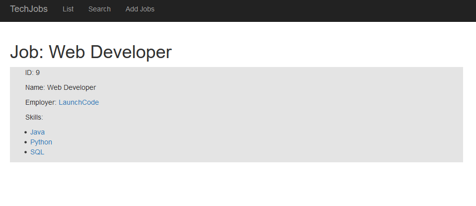

## After clicking on the "SQL" skill.

User can now see a description of the skill and a list of every job posting that features
SQL as a required skill.

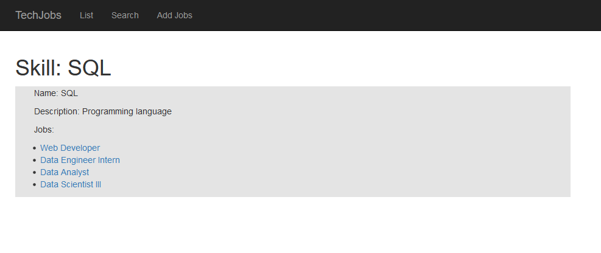

## After clicking on the job "Data Engineer Intern".
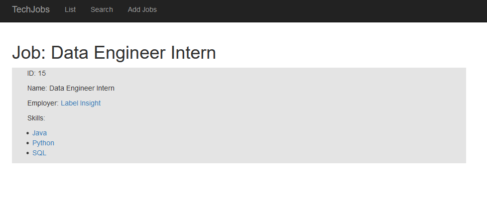

## After clicking on the employer "Label Insight"

Users can now see details about the selected employer (currently just the name and location).
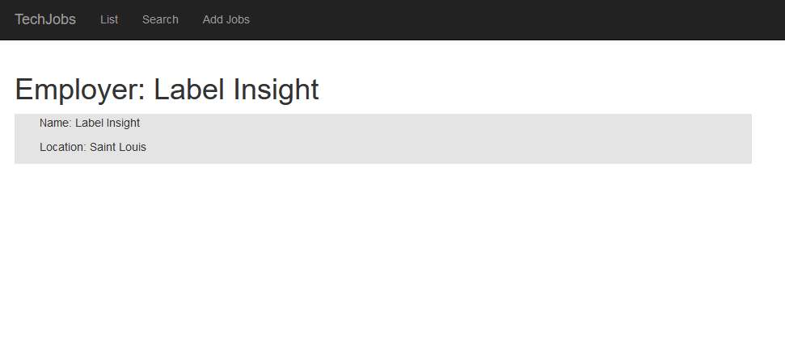

## The "List" view (after selected "List" on the navbar at the top of screen).

Displays a list of every employer and every skill currently in the database.

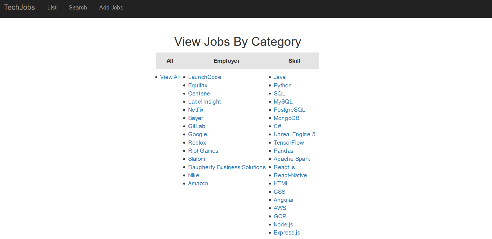

## The "Search" view (after selected "Search" on the navbar at the top of screen).
...prior to searching for the term "data" across employers and skills (i.e. "All") for every job.

## After searching for jobs with the term "data" in "All" categories (i.e. "Employer" and "Skill").
Displays all jobs with the word "data" in one of its fields.

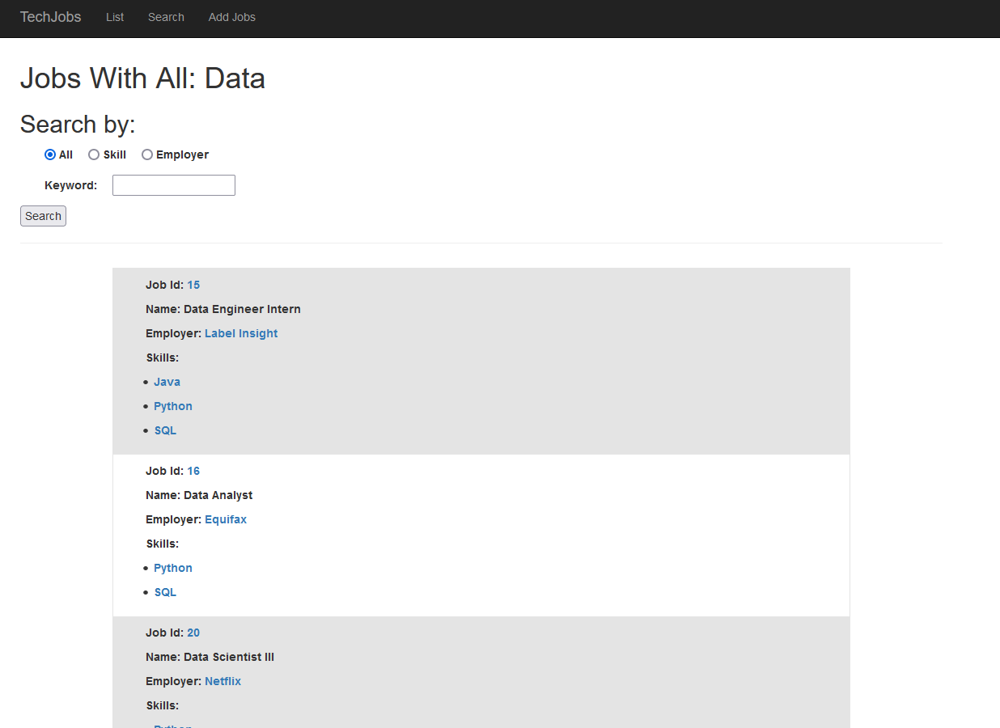

## After searching for the phrase "Apache Spark" in the "Skill" category.
Will return a list of all jobs with the phrase "Apache Spark" in one of its required skills.

## The "Add Job" form.
This page allows users to type a name, choose an employer, and choose various skills to create
a new job posting.

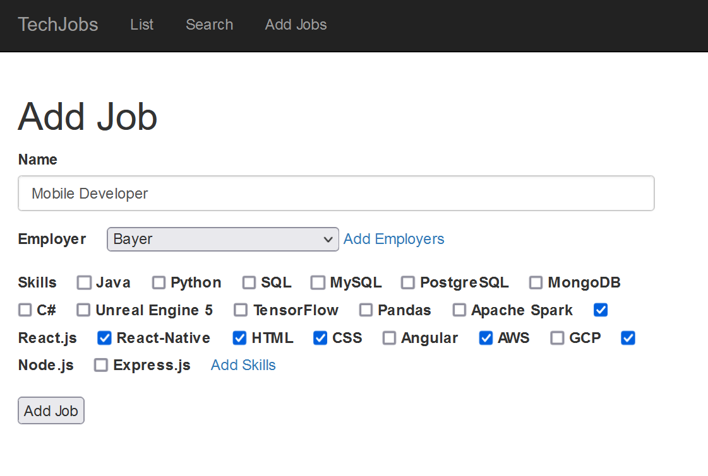

## After clicking the "Add job" button from the previous page (redirect user to home screen).

Now displays the newly added job on the home page.

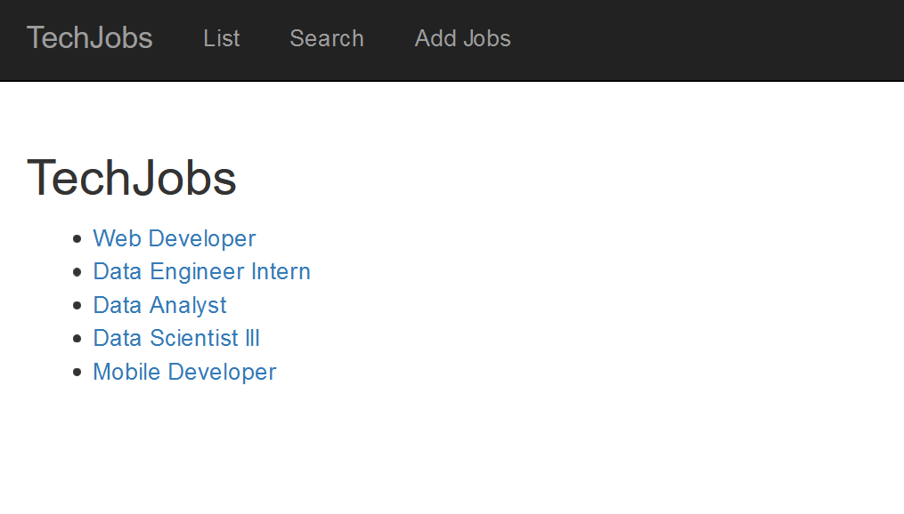

## Result set from a SQL query for all jobs in the jobs table.
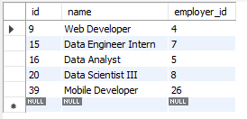

## Add employer form.
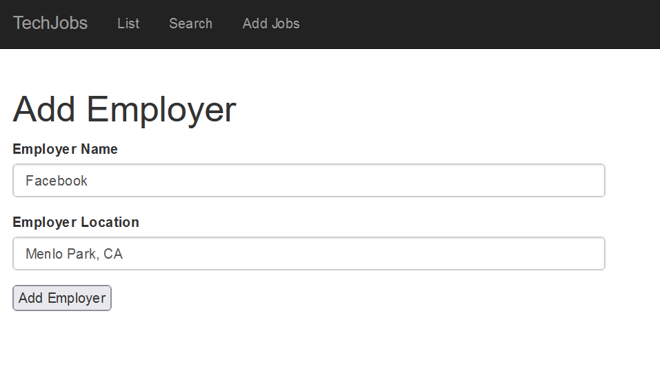

## After adding an employer (newly added employer is display at the bottom of list).
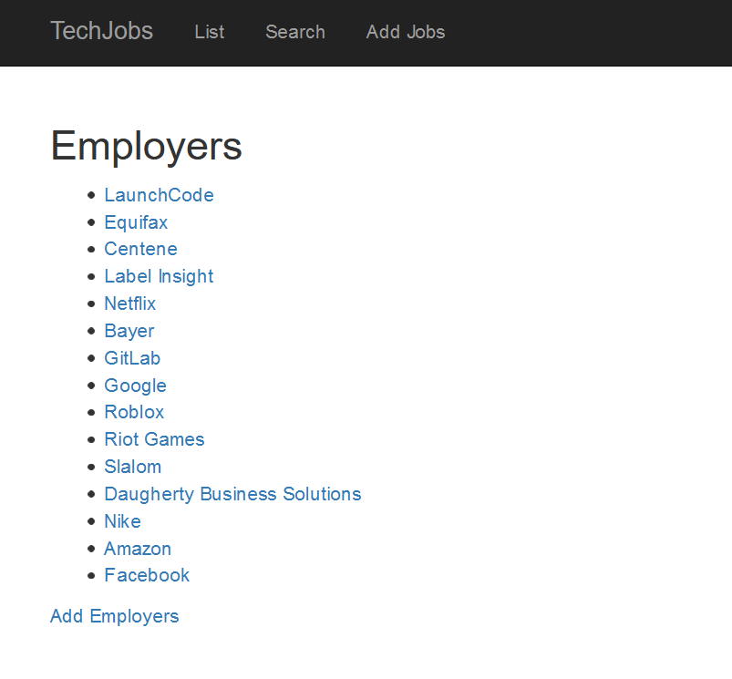

## Add skill page.
After adding a skill.

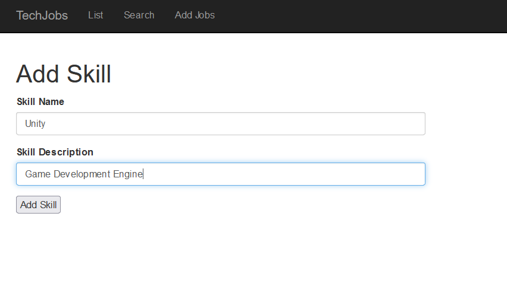

## After adding skill (newly added skill is display at the bottom of list)
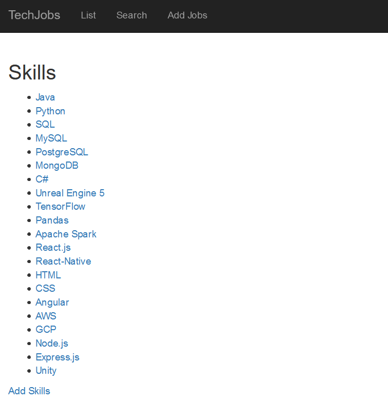
